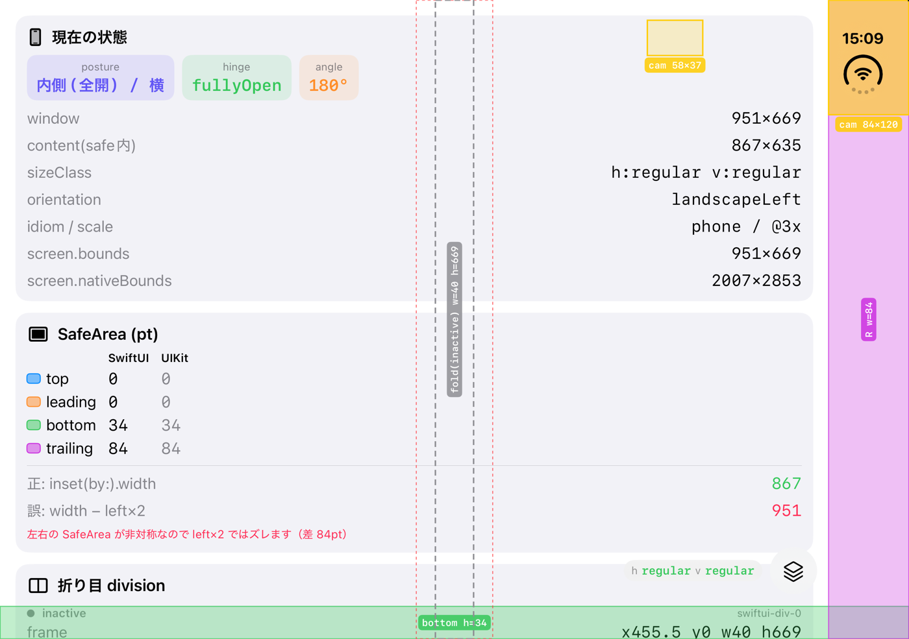
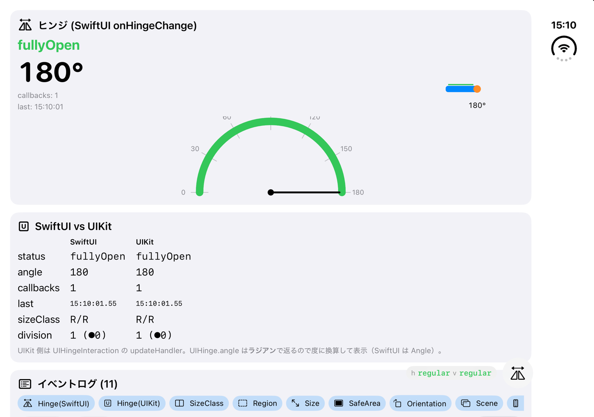
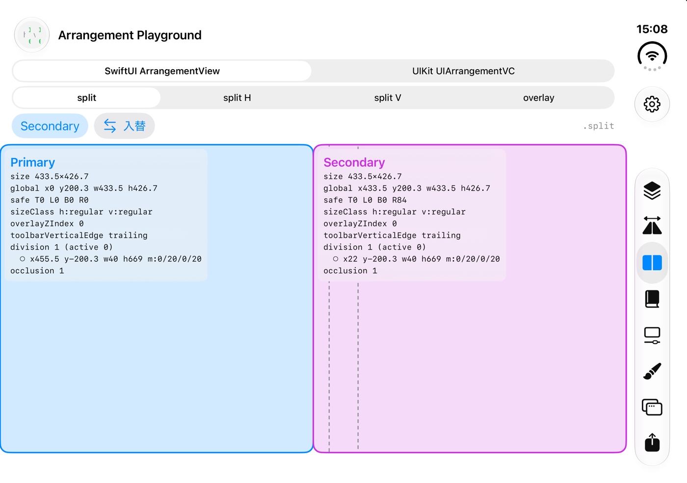
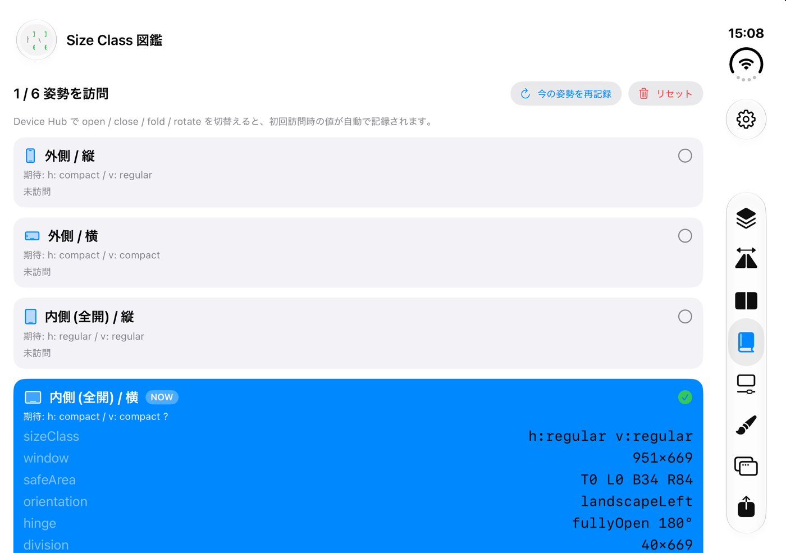
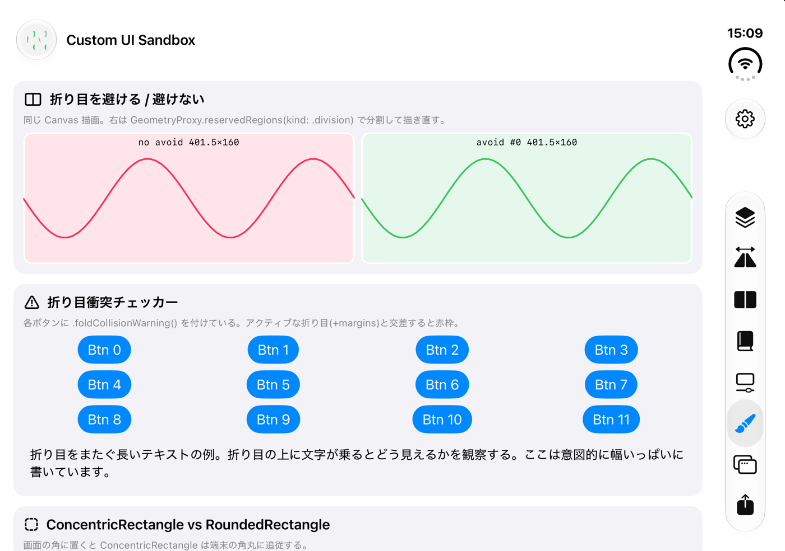

# DuoInspector

iPhone Duo（折りたたみ iPhone）の **SafeArea・折り目・ヒンジ状態・Size Class・ArrangementView** の挙動を、色分けと数値で可視化する学習用アプリです。
Duo 対応アプリを作る前に「実際に OS からどんな値が返ってくるのか」を目で確かめるためのツールとして作りました。



## 動作環境

- iOS 27.1 以降 / Xcode 27.1 以降（Duo 向け API は iOS 27.1 で追加）
- iPhone Duo シミュレータ（Xcode 27.1 に付属。Device Hub で open / close / fold / rotate を操作できます）
- SwiftUI + UIKit（比較用）

## 画面一覧

| 画面 | 見られるもの | 主な API |
|---|---|---|
| **Overlay Inspector** | SafeArea 4 辺 / 折り目 / カメラ領域を色分け表示し、各領域の pt 値をラベルで直書き。`inset(by:)` の正しい幅と `left×2` の誤算幅の差も表示 | `GeometryProxy.safeAreaInsets`, `reservedRegions(kind: .division / .occlusion, options: [.includeInactive])` |
| **Hinge Monitor** | ヒンジの status / angle をリアルタイム表示。半円ゲージと側面ミニチュア、SwiftUI と UIKit の値・発火回数・時刻を並べて比較。全イベントのログ（フィルタ付き） | `.onHingeChange`, `DeviceHinge`, `UIHingeInteraction`, `UIHinge` |
| **Arrangement Playground** | Primary / Secondary の 2 パネルを `.split` / `.split.axes(.horizontal)` / `.split.axes(.vertical)` / `.overlay` で切替。各パネルが自分のサイズ・Size Class・zIndex・折り目を表示。UIKit 版は `state(for:)` の値も表示 | `ArrangementView`, `arrangementViewStyle`, `overlayArrangementZIndex`, `UIArrangementViewController`, `UISplitArrangement`, `UIOverlayArrangement` |
| **Size Class 図鑑** | 6 姿勢（外側縦横 / 全開縦横 / 半開き縦横）を初回訪問時に自動記録し ✔ が付く。スライド記載の期待値と実測を照合 | `horizontalSizeClass`, `verticalSizeClass`, `UIWindowScene.interfaceOrientation` |
| **Toolbar Lab** | ツールバー項目の縦配置挙動をトグルで観察 | `toolbarVerticalEdge`, `axisBehavior`, `toolbarVerticalCompressionBehavior`, `visibilityPriority` |
| **Custom UI Sandbox** | 折り目を避ける Canvas と避けない Canvas の比較、View が折り目に跨ったら赤枠で警告する `.foldCollisionWarning()`、`ConcentricRectangle` と `RoundedRectangle` の角比較 | `reservedRegions`, `onGeometryChange`, `ConcentricRectangle` |
| **Scene Lab** | 新しい Scene の起動（SwiftUI / UIKit）と、外側ディスプレイ向け Scene Accessory の登録実験 | `openWindow`, `activateSceneSession`, `UISceneAccessory`, `registerSceneAccessory` |
| **Export** | 計測値を Markdown / JSON でコピー・共有、オーバーレイ入りスクリーンショットを写真に保存 | `ShareLink`, `ImageRenderer` |

ナビゲーションは歯車メニューから **TabView / NavigationSplitView / なし（bare）** を切り替えられます。タブバーやナビバーが SafeArea や Size Class に与える影響を、同じ姿勢のまま比較できます。

<p>


</p>
<p>


</p>

## 色の対応

| 色 | 意味 |
|---|---|
| 青 / 緑 / 橙 / 紫 | SafeArea の top / bottom / leading / trailing |
| 赤の斜線 | 折り目（division）がアクティブ（半開きなど、実際に画面を分割している状態） |
| 灰の破線 | 折り目が非アクティブ（全開時。`includeInactive` で取得） |
| 赤の点線 | 折り目の `margins` を含めた「避けるべき」範囲 |
| 黄 | カメラ等の occlusion 領域 |
| 緑の破線 | `bounds.inset(by: safeAreaInsets)` の有効矩形 |
| ピンクの点線 | `width − safeAreaInsets.left × 2` で計算した誤った矩形 |

## シミュレータで分かったこと（iOS 27.1 beta, iPhone Duo）

- 内側ディスプレイは **669×951pt**（2007×2853 @3x）、外側は **466×678pt**（1398×2034 @3x）。
- 全開・横向きでは Size Class が **regular / regular**。タブバーは右端の縦バーになる。
- 折り目は **幅 40pt**、`margins` は左右 20pt。全開時は `isActive == false` で、`includeInactive` を付けないと取れない。
- 横向きの trailing SafeArea **84pt** はタブバーではなくカメラ列（occlusion 84×120）由来。bare モードでも残る。
- 左右の SafeArea が非対称なので、`safeAreaInsets.left * 2` で幅を出すと 84pt ずれる。
- `UIHinge.angle` は **ラジアン**で返る（SwiftUI の `DeviceHinge.angle` は `Angle`）。

## 使い方

1. `DuoInspector.xcodeproj` を Xcode 27.1 以降で開く
2. 実行先に **iPhone Duo** シミュレータを選んでビルド
3. Simulator の **Device Hub** で open / close / fold / rotate を切り替えると、各画面の値が変化しログに残る

### 起動引数（検証用）

Scheme の Arguments に `key=value` 形式で指定できます（`-key value` 形式は UserDefaults の引数ドメインに入りアプリ内の設定変更を上書きしてしまうため使っていません）。

| 引数 | 値 |
|---|---|
| `screen=` | `overlay` `hinge` `arrangement` `sizeClass` `toolbar` `customUI` `scene` `export` |
| `nav=` | `tab` `split` `bare` |
| `overlay=1` | 全画面オーバーレイを最初から ON |
| `demo=1` | 画面・オプション・配置スタイル・ナビを自動で巡回するデモツアー（録画用） |

コマンドラインからの例:

```bash
xcrun simctl launch --terminate-running-process booted devplaceholder.DLFH998L.DuoInspector demo=1 nav=tab
xcrun simctl io booted recordVideo --codec h264 demo.mp4
```

## 構成

```
DuoInspector/
  Core/         DuoState（全計測値の単一ソース）, DuoProbe（ルートに付ける計測 modifier）,
                UIKitBridges（UIHingeInteraction / UIView.reservedRegions）, Posture, EventLog
  Navigation/   RootView（Tab / Split / bare 切替）, Screen
  Screens/      8 画面
  Components/   RegionOverlay（色分け描画）, HingeGauge, LocalGeometryPanel など
```

## 参考

- [速習 iPhone Duo 対応](https://speakerdeck.com/yuukiw00w/su-xi-iphone-duodui-ying)（野瀬田裕樹氏）
